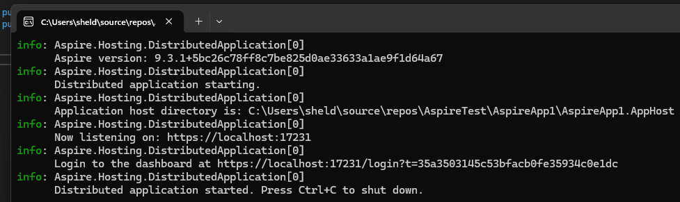
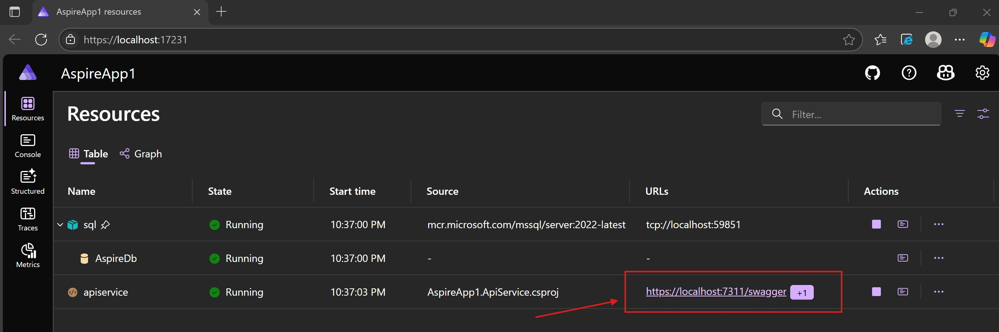
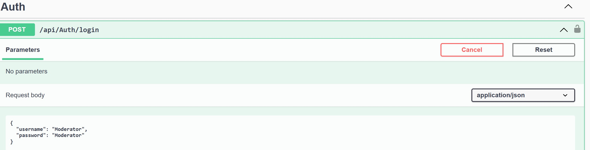

# AspireTest Solution

## Overview
This solution is a clean architecture ASP.NET Core Web API project using Dapper for data access and SQL Server for storage. It features JWT authentication, claims-based user identification, and a modular, testable structure. The project is designed for maintainability, scalability, and ease of testing.

## Technologies Used
- **.NET 8** (ASP.NET Core Web API)
- **Dapper** (micro-ORM for SQL Server)
- **SQL Server** (local or containerized)
- **JWT Authentication** (with custom token service)
- **Password Hashing** (SHA256)
- **Swagger/OpenAPI** (with JWT Bearer support)
- **xUnit, NUnit, Moq, FluentAssertions** (unit testing)
- **Clean Architecture** (separation of concerns: Application, Domain, Infrastructure, API)

## Project Structure
- `AspireApp1.ApiService/` - Main API project (controllers, services, repositories)
- `AspireApp1.AppHost/` - Database and app host (init-db.sql, configuration)
- `AspireApp1.ServiceDefaults/` - Shared service defaults
- `AspireApp1.Tests/` - Unit tests (mirrors API structure)

## Dependencies
- Microsoft.AspNetCore.Authentication.JwtBearer
- Dapper
- Microsoft.Data.SqlClient
- Swashbuckle.AspNetCore (Swagger)
- Moq
- FluentAssertions
- NUnit, xUnit, Microsoft.NET.Test.Sdk


### Prerequisites
- [.NET 8 SDK](https://dotnet.microsoft.com/download)
- [Docker](https://www.docker.com/products/docker-desktop) (must be running)
- SQL Server running in a Docker container (see below)

### Database Setup
1. Ensure Docker is running.
2. The AppHost project will automatically start a SQL Server container and run the `init-db.sql` script to create and seed the database when you launch the solution.
3. If needed, update the connection string in `AspireApp1.ApiService/appsettings.Development.json` (default: `Server=localhost,1433;Database=AspireDb;User Id=sa;Password=Your_password123;TrustServerCertificate=True;`).

### Running the Application
**Recommended:**
1. Open the solution in Visual Studio and press F5 to launch. This will start all required projects, including AppHost for database setup and the API.

**Alternatively, using the terminal:**
1. Restore dependencies:
   ```sh
   dotnet restore
   ```
2. Build the solution:
   ```sh
   dotnet build
   ```
3. Run the AppHost project (which will start the database and API):
   ```sh
   dotnet run --project AspireApp1/AspireApp1.AppHost/AspireApp1.AppHost.csproj
   ```
4. Click on the aspire dashboard link on the terminal to launch.

## Getting Started
## Screenshots

### Starting the Application

The first run will take a few minutes to obtain the images and setup the database and seed data.
Once this happens the sql container is persisted and the solution will start up much quicker.



### Aspire Dashboard & Swagger UI
Once the application is running, open the Aspire dashboard (URL shown in the terminal output). You can click the Swagger link to access the API documentation and test endpoints:



> **Tip:** Click the highlighted Swagger link in the dashboard to open the API documentation in your browser.

### Running Tests
1. Navigate to the test project:
   ```sh
   cd AspireApp1/AspireApp1.Tests
   ```
2. Run all tests:
   ```sh
   dotnet test
   ```

## Notes
- All business logic is in the Application layer; controllers are thin.
- JWT authentication is required for most endpoints. Use the `/api/auth/login` endpoint to obtain a token.
  - A moderator role user with username Moderator and password Moderator has been initalized in order to test tagging.
  - 
- The database is seeded with sample users, posts, comments, likes, and tags for development/testing.
- The solution follows best practices for dependency injection, testability, and maintainability.
- Each time the solution is run the tables are dropped and re-created to be able to maintain a smaller database.
- My preference would have been to create stored procedures and not inline sql for the compile time / query plan advantage. Due to this being a test inline sql is fine.

---

For any issues or questions, please open an issue or contact the maintainer.
